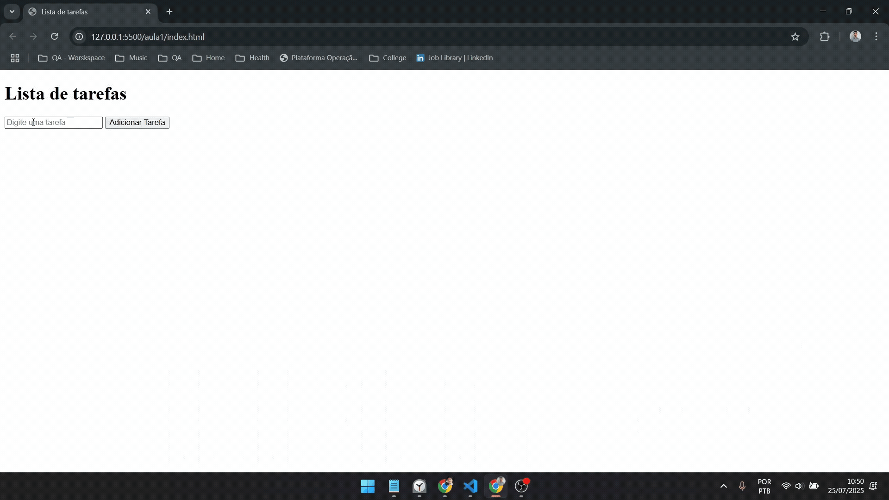
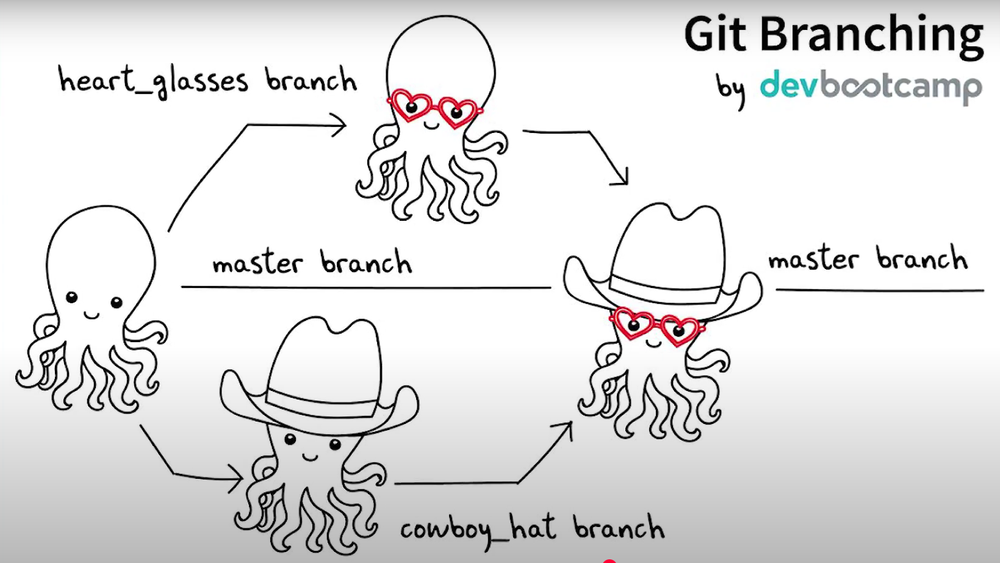

## 🎯 Objetivo


## 🚀 Precondições

- Instalar **Git**: [gitforwindows.org](https://gitforwindows.org)
- Instalar **VSCode**: [Download](https://code.visualstudio.com/download)
- Instalar extensão **LiveServer**
- Criar conta no **GitHub**: [github.com](https://github.com)

---

## 🗂️ Git

- **Definição:** Sistema de controle de versão
- **Explicação:** [Vídeo introdutório](https://www.youtube.com/watch?v=e9lnsKot_SQ)



### ⚙️ Comandos comuns do Git

#### Configuração de usuário

```bash
git config --global user.name "seu-nome-github"
git config --global user.email "seu@email-github.com"
git config --global --list
```

#### Comandos principais

```bash
git init
git clone {url}
git add .
git commit -m "mensagem"
git push origin {nome-branch}
```

---

## 🐙 GitHub

- **Definição:** Plataforma de hospedagem de código

---

## 🖥️ VSCode

- **Definição:** IDE (Ambiente de Desenvolvimento Integrado)

---

## ❓ Dúvidas

- Alguma dúvida quanto a **Git/GitHub/VSCode**?

---

## 🏋️ Exercícios

- Prática com animação: [Learn Git Branching](https://learngitbranching.js.org/?locale=pt_BR)
    - **Obs:** Realizar níveis 1, 2 e 3.

---

## 🛠️ Construindo FE

### 🧰 Tecnologias

- **HTML/CSS**: Linguagens de marcação para estrutura e estilo
- **JavaScript**: Linguagem de programação para interatividade


