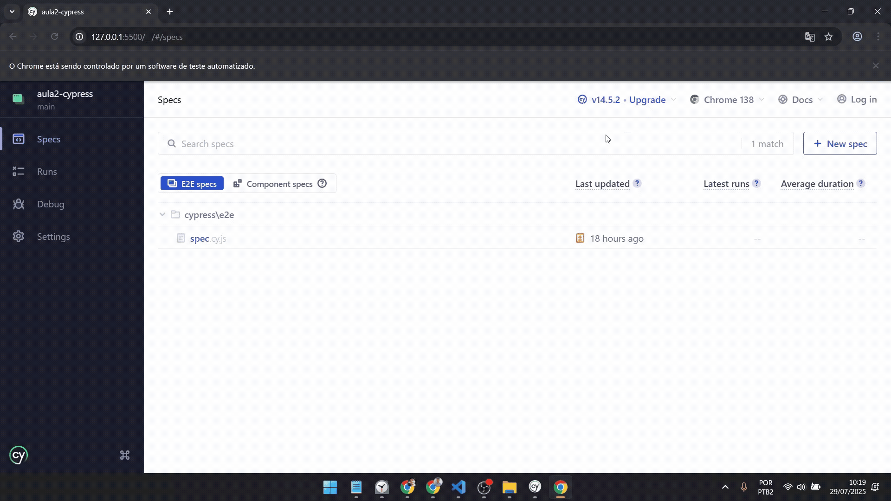

## 🎯 Objetivo


## 🗂️ Materiais

- Técnicas de teste - https://blog.testlodge.com/positive-negative-destructive-test-cases/
- Gitignore - https://www.toptal.com/developers/gitignore/

## Princípios

- DRY (Don't repeat yourself)

### ⚙️ Comandos

#### Configuração
```bash
npm init -y
npm install cypress -D
npx cypress open
```

#### Ações
```bash
localizador: .get()
asserção: .should()
```

## 🖥️ Cypress

- **Definição:** Ferramenta de testes E2E
- **Localizadores:** Propriedades/valores em tags HTML para localizar objetos no DOM (Document Object-Model)
- **DOM:** Documento que comporta objetos da página seguindo estrutura de árvore

### 🧰 Tecnologias

- **Cypress**: Ferramenta de testes E2E

