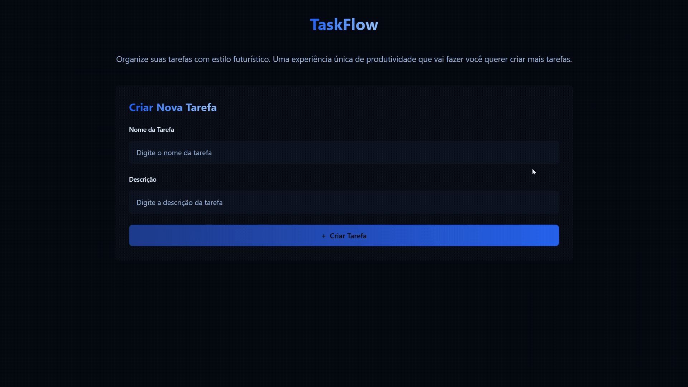

## 🎯 Objetivo



### 🏗️ Arquitetura

- **React**: biblioteca JavaScript para criar interfaces de usuários.
- **Vite**: builds rápidos e hot reload.

```bash
npm create vite@latest
npm install
npm run dev
```

### 🎨 Estilização

Tailwind: framework CSS para rapidez no design

```bash
npm install tailwindcss @tailwindcss/vite
```

Demais passos: https://tailwindcss.com/docs/installation/using-vite

### 📚 Estudo da semana

Estudar sobre **CSS** e **Flexbox**:

- [Artigo no FreeCodeCamp com diagramas animados](https://www.freecodecamp.org/portuguese/news/flexbox-a-ficha-informativa-perfeita-de-flexbox-no-css-com-diagramas-animados/)
- [Vídeo no YouTube explicando Flexbox](https://www.youtube.com/watch?v=GteJWhCikCk&t)
