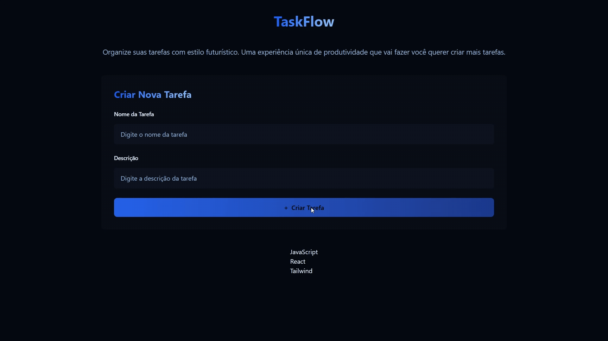

## 🎯 Objetivo



### 🏆 Boas práticas

Object Calisthenics - Jeff Bay

7° - Keep all entities small

### 📚 Teoria

[useState e Hooks](./fe/src/AppV1.jsx)

[Foreach e Map](./foreach-map.md)

### 🔑 UUID

```bash
npm install uuid
```

### Perguntas

    Porque utilizar <span> e não <p> dentro do <button>?

| Abordagem        | Vantagens                                                         | Desvantagens                                                  | Quando usar                                                                    |
| ---------------- | ----------------------------------------------------------------- | ------------------------------------------------------------- | ------------------------------------------------------------------------------ |
| **`<span>`**     | Não quebra linha e permite estilizar separadamente ícone e texto. | Mais código.                                                  | Quando quiser separar **ícone e texto** no botão, aplicando estilos distintos. |
| **`<p>`**        | Cria blocos automáticos de texto.                                 | Quebra linha por padrão e dá mais trabalho de manipular.      | Evitar, de preferência não use.                                                |
| **Texto direto** | Simples e menos código.                                           | Difícil de aplicar estilizações em partes separadas do texto. | Quando não for necessário diferenciar estilo entre partes.                     |
