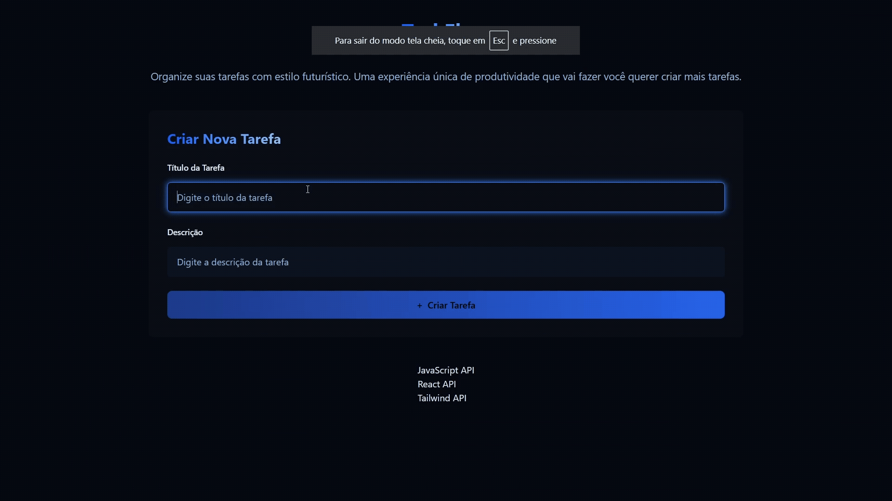

## 🎯 Objetivo



---

## 📚 Teoria

### 🤝 Como dois sistemas se comunicam?

- Analogia: Um americano conversando com alguém que não sabe inglês.
- Comunicação exige uma "tradução" — é aí que entra a API!

### 🍽️ História: Restaurante

- Comunicação entre camadas:
  - **Frontend (FE)** ⟷ **API** ⟷ **Backend (BE)**

### 🧠 Definição

- **API**: _Application Programming Interface_  
  Interface de Programação de Aplicações — um conjunto de regras que permite que sistemas diferentes conversem entre si.

---

## 🔗 API, Endpoints e API REST

  
🔗 [Entenda sobre API de uma vez por todas](https://medium.com/@crystian.lf/entenda-sobre-api-de-uma-vez-por-todas-fb5475df8db0)

### 🧭 API REST

- Baseada na arquitetura **REST** (_Representational State Transfer_).
- Utiliza os métodos HTTP para operações:

```text
🆕 Create → POST
🔍 Read → GET
✏️ Update → PUT
❌ Delete → DELETE
```

---

## 🐍 FLASK

### ⚙️ Instalação e uso

```python
# Instalar Flask
pip install Flask

# Testar instalação
flask --version

# Rodar servidor
flask --app server run
```

---

## 🌐 CORS

### 📖 Definição

- **CORS**: _Cross-Origin Resource Sharing_  
  Compartilhamento de Recursos entre Origens Diferentes.

### 🧩 Lógica

- É definido por: **protocolo + domínio + porta**

### 🚫 Situação comum

- Ocorre quando o **Backend** não libera acesso para o **Frontend**.

### 🧪 Exemplo

```text
Frontend (React): http://localhost:5173
Backend (Python): http://localhost:5000
```

### 🔧 Instalação do CORS

```python
pip install flask-cors
```

---

## ❓ Perguntas
