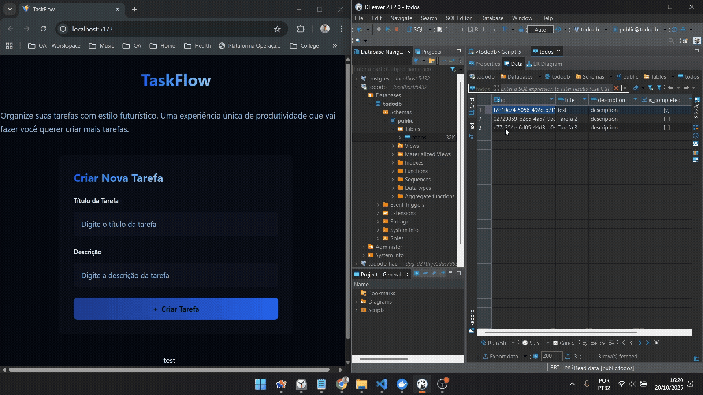

## 🎯 Objetivo



---

## 🧰 Pré-requisitos

- 🐳 [Docker](https://www.docker.com/get-started): plataforma de containers
- 🐘 [DBeaver](https://dbeaver.io/download/): ferramenta de gerenciamento de bancos de dados

---

## 📚 Teoria

### 🐳 Docker

- **Definição:** Plataforma de virtualização de serviços a nível de Sistema Operacional (SO)
- **Função:** Garante consistência de versões de pacotes, dependências, SOs e da aplicação entre cliente e equipe

### 🐘 DBeaver

- **Definição:** Ferramenta gráfica para gerenciamento de bancos de dados
- **Função:** Facilita o acesso, visualização e manipulação de dados

### 🗃️ SQL

- **Definição:** Linguagem de Consulta Estruturada
- **Função:** Armazenar, manipular e recuperar dados em bancos de dados relacionais

---

## 🧩 Manipulando Banco de Dados

### 🐘 Criando container PostgreSQL

```bash
docker pull postgres:15

docker run --name postgres-terminal \
  -e POSTGRES_PASSWORD=terminal \
  -e POSTGRES_USER=terminal \
  -e POSTGRES_DB=postgres-terminal \
  -p 5432:5432 postgres:15
```

### 🔁 Automatizando com Docker Compose

```bash
# Constroi os serviços
docker compose up

# Destroi os serviços
docker compose down
```

---

## 🛠️ Comandos SQL

```sql
-- Cria extensão UUID
CREATE EXTENSION IF NOT EXISTS "uuid-ossp";

-- Cria tabela de tarefas
CREATE TABLE IF NOT EXISTS todos (
  id UUID PRIMARY KEY DEFAULT uuid_generate_v4(),
  title TEXT NOT NULL,
  description TEXT,
  is_completed BOOLEAN NOT NULL,
  created_at TIMESTAMP DEFAULT CURRENT_TIMESTAMP
);

-- Insere uma tarefa
INSERT INTO todos (title, description, is_completed)
VALUES ('test', 'description', true);

-- Consulta todas as tarefas
SELECT * FROM todos;
```

---

## 🔌 Conectando com Python

```bash
pip install psycopg2-binary
```

- 📦 `psycopg2-binary`: biblioteca para conectar o servidor Python ao PostgreSQL

---

## ❓ Perguntas
